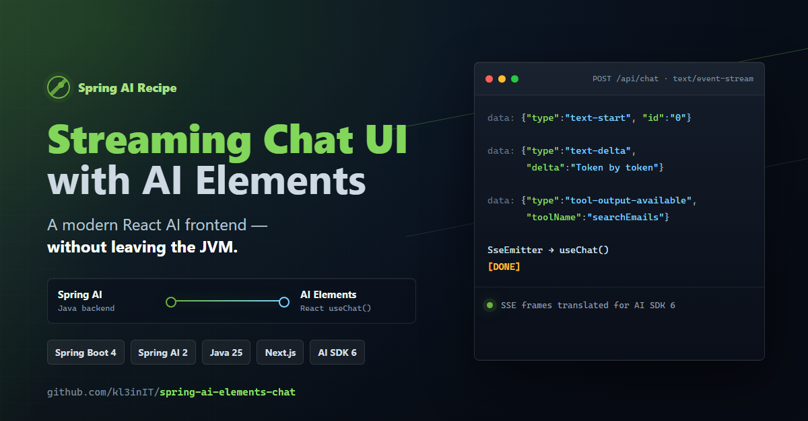
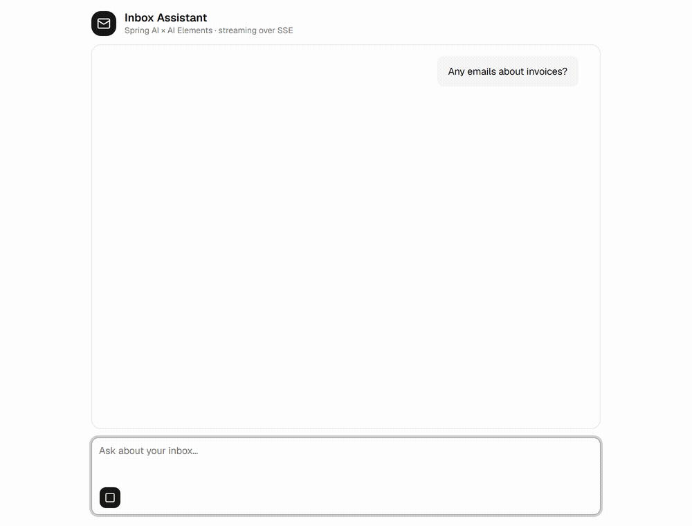

<div align="center">



# Spring AI × AI Elements

**A modern, streaming AI chat UI — backed entirely by Spring Boot.**

[](https://spring.io/projects/spring-boot)
[](https://spring.io/projects/spring-ai)
[](https://openjdk.org/)
[](https://nextjs.org/)
[](https://ai-sdk.dev/)
[](LICENSE)

</div>

A Java/Spring developer's path to a modern React AI UI — **without leaving the JVM.**

`useChat` (Vercel **AI Elements**) doesn't consume raw text; it speaks a specific wire format — the
AI SDK **UI Message Stream**, over SSE. This repo is the small bridge that makes a **Spring AI** backend
speak it, so streamed text, live tool calls, and conversation memory just work in a polished React UI.

The demo is an **Inbox Assistant**: ask about your emails, watch the model call a `searchEmails` tool and
stream a reply.

## Demo

<div align="center">



<em>The <code>searchEmails</code> tool call renders inline while the answer streams back — every frame served by Spring Boot.</em>

</div>

## How it works

```
Next.js + AI Elements (useChat)  ──POST {message, conversationId}──▶  Spring Boot (servlet)
              ▲                                                          ChatController → SseEmitter
              │   SSE: UI Message Stream (text-delta / tool-* / [DONE])  └─ Spring AI ChatClient.stream()
              └──────────────────────────────────────────────────────────  + @Tool + window memory
```

- **`Flux` inside, SSE at the edge.** Spring AI produces a `Flux` of tokens + tool events; `UiMessageStream`
  encodes each as a UI Message Stream frame and pushes it over `SseEmitter`.
- **Pure tools.** `@Tool` methods just return data; `EventEmittingToolManager` (a `ToolCallingManager`
  decorator) surfaces tool input/output to the UI centrally.
- **Memory.** `MessageWindowChatMemory` keyed by `conversationId` keeps multi-turn context server-side.

One frame the wire actually carries:

```
data: {"type":"text-delta","id":"0","delta":"You have "}
data: {"type":"tool-input-available","toolCallId":"...","toolName":"searchEmails","input":{"query":"invoice"}}
data: {"type":"tool-output-available","toolCallId":"...","output":[...]}
data: [DONE]
```

Response header `x-vercel-ai-ui-message-stream: v1` tells `useChat` to parse it as a UI Message Stream.

## Run it

Needs **JDK 25**, **Node 20+**, an **OpenAI API key**.

```bash
# backend  → http://localhost:8080
cd backend
cp .env.example .env          # then put your OPENAI_API_KEY in .env (gitignored)
./gradlew bootRun

# frontend → http://localhost:3000
cd frontend
npm install
npm run dev
```

Open **http://localhost:3000** and ask *"any emails about invoices?"*. In dev, Next.js proxies
`/api/*` to `:8080`, so there's no CORS to configure.

## Stack

Spring Boot 4.1 · Spring AI 2.0 · Java 25 · Gradle — Next.js 16 · React 19 · AI SDK 6 · AI Elements.

## License

MIT — see [LICENSE](LICENSE).
